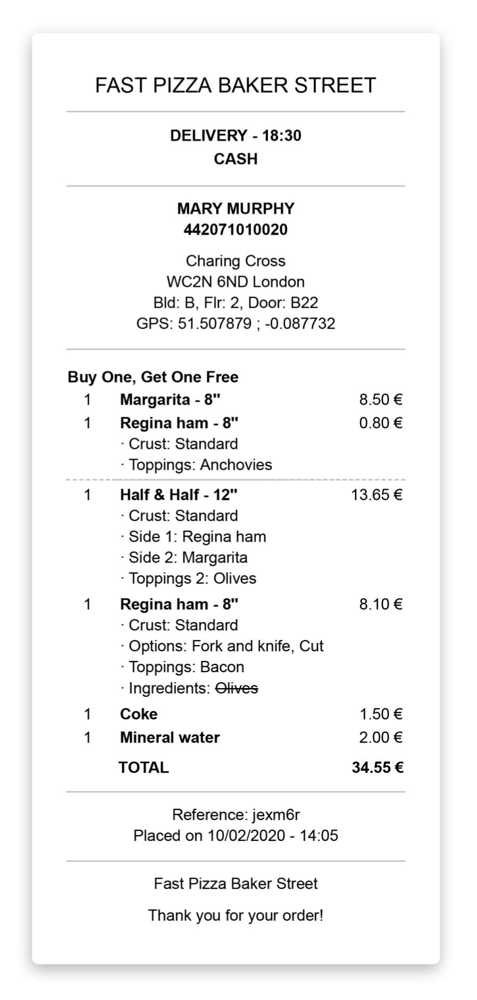

OrderLine connects to printers recognised by the operating system. It uses the system print dialog to print receipts.

To print an Order receipt from a local printer, follow these steps:

1. View order details.
2. Click **PRINT**.
3. Follow the instructions on the browser print dialog.

OrderLine also prints order receipts automatically upon order reception, skipping the print dialog. Auto printing requires the printer to be registered in Google Cloud Print. For more details, see [Printing](/apps/orderline/settings/#printing).

## Order Receipt

Receipts are presented into sections for readability with a solid line starting and ending each section. These reflect the same information as listed on the Order Card. For more information on Order Cards see [OrderLine View Order](#view-order).

Receipts include the following information:

- The Order type. Types include **DELIVERY**, **COLLECTION** or **EAT-IN**.
- Payment type.
- The address and delivery comments with GPS coordinates, if the online ordering solutions sends the GPS coordinates to HubRise.
- The delivery time confirmed by users to reflect the actual delivery time, if supported by the POS system. For more information, see [ Additional Data Prompt](/apps/orderline/settings/#additional-data-prompt).
- Deals are listed with the name of the deal followed by the list of products included in the deal.
- Products the client ordered are grouped together with additions and exclusions listed in bullet points including:
  - Standard items removed from the product are struck out with a solid line.
  - Options.
  - Toppings or other additions.
- Reference displays the Order number. Delivery date and time will display only if the confirmed delivery time differs from the original delivery time.
