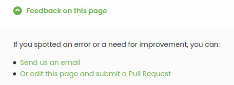

## Introduction

This guide provides instructions for when you want to contribute your documentation to the HubRise documentation. It provides instructions on style guide specifications, spelling, style and technical documentation.

The goal of the documentation is to provide technical assistance in respect of your app and its integration into the HubRise platform. Therefore, it should be written in sufficient detail in order to impart the necessary information to the reader.

An example of proper documentation can be found [here](/apps/livepepper/connect-hubrise).

## Process

For every app for which an integration with HubRise exists, a page will be created. On the [Apps](/apps) page, **click** on the icon for the app which will take you to the page for the app. For example, if you click on the icon for [LivePepper](/apps/livepepper), you will be taken to the Overview page for [Livepepper](/apps/livepepper).

Once on the page, **scroll** down to the bottom. At the bottom of the page, you will find the **Feedback on this page** link.

**Click** on the link which will open a dropdown list of options.

Here you have the option to edit the page and submit a **Pull Request**. It is here where you can make your contributing to the documentation on the HubRise website.

The documentation will be written in Markdown and managed/stored stored on a GitHub repository. We use Docker and Webstorm but you are welcome to use any IDE you feel most comfortable with. WebStorm is a good option if you have no preference.

For review the HubRise internal team will suggest modifications by editing the markdown and make comments on Github Issues.
Once the documentation is considered final, its content will be published and connected to the HubRise Apps page on our corporate website.

Our documentation is not literature, we should reuse as much of the existing content as we can and copy the structure from one app to the other.

## Style

All contributions to the HubRise documentation should be made with a certain style. This style of writing determines what language to use, the tone and the specifications for technical writing. For the necessary requirements, we use the [Style Guide](/contributing/style-guide).

The [Style Guide](/contributing/style-guide) provides information on, for example:

> - Punctuation
> - Capitalisation
> - Readability
> - References
> - Headings and Titles, etc.

For further guidance on the style, please refer to the [Style Guide](/contributing/style-guide).

## Screenshots

When it becomes necessary to supplement your documentation with screenshots, these screenshots have to comply with certain technical specifications. Our [Screenshots Guide](/contributing/screenshots-guide) provides guidance on these specifications.

For more information on how to use screenshots in your documentation, please refer to the [Screenshots Guide](/contributing/screenshots-guide).

## Videos

When it becomes necessary to supplement your documentation with videos, these videos have to comply with certain technical specifications. Our [Videos Guide](/contributing/video-guide) provides guidance on these specifications.

For more information on how to use screenshots in your documentation, please refer to the [Videos Guide](/contributing/video-guide).
