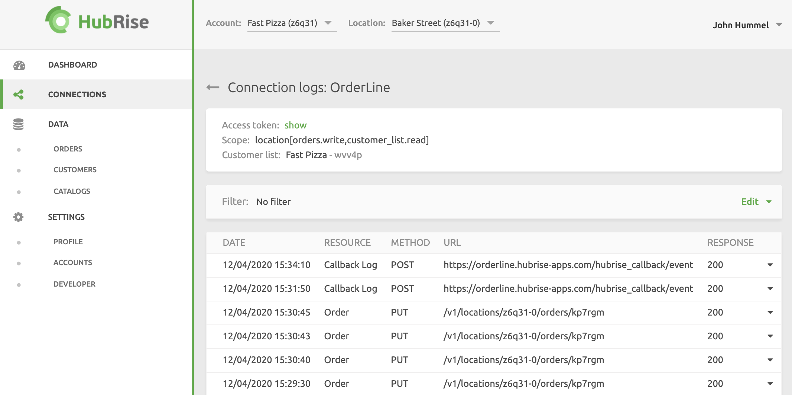

From Connections, you can connect new apps and see apps connected to your HubRise Account.

Apps are connected either with a HubRise Account or Location depending on the app. Typically EPOS or Online Ordering System will connect to a Location, while marketing solutions connect to either the Account or Locations.

------

**Related FAQ**: <Link to="/docs/faqs/what-app-can-i-connect-to-hubrise/">What App Can I Connect to HubRise?</Link>

------

## Connecting a New App

To connect a new app to your HubRise Account:

1. Log in to HubRise from the [HubRise Login page](https://manager.hubrise.com/login).
2. Click **CONNECTIONS** on the left navigation panel.
3. Select **View available apps**.
4. Select the app you want to install.
5. Follow the instructions for the specific app. When installing a new app, you will be required to grant the app access to your HubRise Account.

## Open An App

Some apps can be accessed from HubRise. If so, you can open the app by clicking on **CONNECTIONS** and selecting **Open** for the specific app. The app will open in a new browser window.

<video controls title="Connect an App">
  <source src="../images/011-en-connections-open-app.webm" type="video/webm"/>
</video>

## View Connection Activity

To display a line chart with the number of transactions made in the last 30 days, select **CONNECTIONS** > **Actions** > **View Activity**. This is a handy way to see if transactions are going through the connection.

<video controls title="Display activity for a connected app">
  <source src="../images/012-en-connections-display-activity.webm" type="video/webm"/>
</video>

------

**Related FAQ**: <Link to="/docs/faqs/check-connection-between-my-system-and-hubrise/">How Do I Check If the Connection Between My System and HubRise Is Working?</Link>

------

## View Connection Logs

Logs are stored for each app that has been connected. These logs are used to understand the communications between systems and detect issues. To view logs for a connection, select **CONNECTIONS** > **Action** > **View logs** for the specific app.

Logs record the requests from an app to HubRise. Each request is a transaction between an app and HubRise. It could be an order, a new customer registered, or any other communication between an app and HubRise.

### General information
At the top, the log page displays general information about the connection:

- **Access token**: The token used by the app to authenticate to HubRise.
- **Scope**: The connection permissions, such as whether the connection can access the Account or a single Location, what read/write access it has on the data, etc.
- **Customer list** and **Catalog**: Depending on the Scope, additional lines can display the ID for the resources that have been granted access to, such as the customer list and the catalog.

### Filter
Logs can be filtered by resource and method through the following process:

1. Select **Edit**.
2. Select the resources and methods that you want to display. To view all log records, uncheck all resources and methods, or click **Reset**.

### Logs
The log page then displays a summary list of requests in reverse chronological order.

Each log record includes:

- **Date**: The date and time of the request.
- **Resource**: The target of the request.
- **Method**: The HTTP method used in communicating the request.
- **Path**: The URL path for the request.
- **Response**: The HTTP response code.

You can see additional details by clicking on a log, including the request and the corresponding response.
To download either the request or response, select the download icon <InlineImage width="15" height="14"></InlineImage>. The selected request or response will be provided as a JSON file.

For more information, see [Understanding Logs in HubRise](/docs/hubrise-logs). For a complete reference on the HubRise API, see the [HubRise API Reference page](/developers/api/general-concepts).

[comment]: # (Understanding Logs in HubRise link not working)

<video controls title="Log details">
  <source src="../images/013-en-connections-view-logs.webm" type="video/webm"/>
</video>

------

**Related FAQ**: <Link to="/docs/faqs/check-connection-between-my-system-and-hubrise/">How Do I Check If the Connection Between My System and HubRise Is Working?</Link>

------

## Disconnect App

Apps can be disconnected from your HubRise Account by selecting **CONNECTIONS** > **Actions**. Find the app in question, then click **Disconnect**.

<video controls title="Remove connection to an app">
  <source src="../images/014-en-connections-remove-app.webm" type="video/webm"/>
</video>
